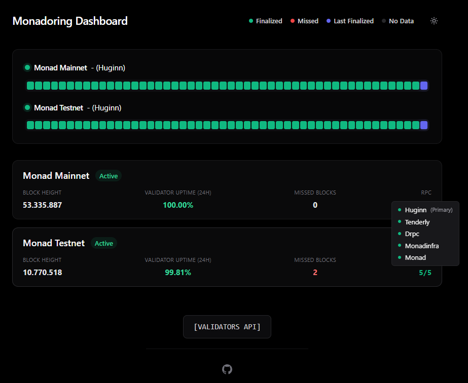

# Monadoring

<div align="center">


[](https://opensource.org/licenses/MIT)
[](https://www.typescriptlang.org/)
[](https://nextjs.org/)

**Validator uptime dashboard for Monad network**

[Features](#features) • [Quick Start](#quick-start) • [Configuration](#configuration) • [Alerts](#alerts) • [API](#api)

</div>

---

<div align="center">



*Validator dashboard with uptime visualization. Example: https://monadoring.huginn.tech/*


</div>

## Features

<details>
<summary><strong>🖥️ Validator Dashboard</strong></summary>
<br>
Web dashboard running on port 3030 with dark/light theme support. Visualize your validator uptime in real-time.
</details>

<details>
<summary><strong>📡 RPC Endpoints</strong></summary>
<br>
Used to display <strong>Current Height</strong>. Auto-failover when primary goes down. Alerts when all RPCs are offline for 3+ minutes.
</details>

<details>
<summary><strong>🔔 Telegram & Discord Alerting (Optional)</strong></summary>
<br>
Get instant notifications for every missed block. Enable <code>RPC_ALERTS=on</code> to also monitor RPC endpoints (offline/online, failover, all RPCs down alerts).
</details>

<details>
<summary><strong>📟 PagerDuty Integration(Optional)</strong></summary>
<br>
Automatically triggers a call when <strong>5 or more consecutive blocks</strong> are missed. Threshold is configurable via <code>.env</code> file.
</details>

<details>
<summary><strong>⚡ No Node Required</strong></summary>
<br>
This alerting/monitoring system <strong>does not require a Monad Node</strong>. Just fill in your <code>.env</code> file properly.
</details>

<details>
<summary><strong>🌐 Monad Validator API</strong></summary>
<br>
All validator events are fetched from <a href="https://monval.huginn.tech/monad-validator-api">Monad Validator API</a>.
</details>

Supports both Mainnet and Testnet.


## Quick Start

**Requirements:** Node.js 20+ and npm

### Option 1: PM2 (Recommended)

```bash
# Install PM2 globally (if not already installed)
npm install -g pm2

# Clone the repository
git clone https://github.com/Huginn-Tech/monadoring.git
cd monadoring

# Install dependencies
npm install

# Copy and configure environment
cp .env.example .env
nano .env  # Edit your configuration

# Build the project
npm run build

# Start with PM2
pm2 start npm --name "monadoring" -- start

# Save PM2 process list (auto-restart on reboot)
pm2 save

# (Optional) Enable PM2 startup on boot
pm2 startup

# Dashboard available at http://localhost:3030
```

**Useful PM2 Commands:**
```bash
pm2 status              # Check status
pm2 logs monadoring     # View logs
pm2 restart monadoring  # Restart app
pm2 stop monadoring     # Stop app
pm2 delete monadoring   # Remove from PM2
```

### Option 2: Docker

```bash
# Clone the repository
git clone https://github.com/Huginn-Tech/monadoring.git
cd monadoring

# Copy and configure environment
cp .env.example .env
nano .env  # Edit your configuration

# Start with Docker
docker compose up -d

# Dashboard available at http://localhost:3030
```

## Configuration

Create a `.env` file in the root directory (copy from `.env.example`):

```bash
# ============================================
# VALIDATORS
# ============================================
# Comma-separated validator IDs to monitor
# Can be numeric IDs or secp addresses
MAINNET_VALIDATORS=1,2
TESTNET_VALIDATORS=1,2

# ============================================
# RPC ENDPOINTS
# ============================================
# Comma-separated RPC endpoints (first one is primary)
MAINNET_RPCS=https://monad-rpc.huginn.tech,https://rpc.monad.xyz,https://rpc1.monad.xyz,https://rpc3.monad.xyz
TESTNET_RPCS=https://monad-testnet-rpc.huginn.tech,https://rpc-testnet.monadinfra.com,https://testnet-rpc.monad.xyz

# Enable RPC health check alerts (on/off)
# Checks all RPCs every 1 minute and alerts on:
# - RPC going offline/online
# - Primary to secondary failover
RPC_ALERTS=off

# ============================================
# SERVER (Dashboard Port)
# ============================================
PORT=3030
HOST=0.0.0.0

# ============================================
# TELEGRAM ALERTS (Optional)
# ============================================
# Get bot token from @BotFather on Telegram
# Chat ID can be obtained from @userinfobot
TELEGRAM_BOT_TOKEN=
TELEGRAM_CHAT_ID=

# ============================================
# DISCORD ALERTS (Optional)
# ============================================
# Create a webhook in Discord: Server Settings > Integrations > Webhooks
DISCORD_WEBHOOK_URL=

# ============================================
# PAGERDUTY ALERTS (Optional)
# ============================================
# Get routing key from PagerDuty service integration
PAGERDUTY_ROUTING_KEY=
PAGERDUTY_THRESHOLD=5
```

### Configuration Details

| Variable | Required | Description |
|----------|----------|-------------|
| `MAINNET_VALIDATORS` | ✅ | Validator ID(s) for Mainnet |
| `TESTNET_VALIDATORS` | ❌ | Validator ID(s) for Testnet |
| `MAINNET_RPCS` | ✅ | RPC endpoints for Mainnet |
| `TESTNET_RPCS` | ❌ | RPC endpoints for Testnet |
| `RPC_ALERTS` | ❌ | RPC monitoring: offline/failover/all-down alerts (on/off, default: off) |
| `PORT` | ❌ | Dashboard port (default: 3030) |
| `TELEGRAM_BOT_TOKEN` | ❌ | Telegram bot token |
| `TELEGRAM_CHAT_ID` | ❌ | Telegram chat/group ID |
| `DISCORD_WEBHOOK_URL` | ❌ | Discord webhook URL |
| `PAGERDUTY_ROUTING_KEY` | ❌ | PagerDuty routing key |
| `PAGERDUTY_THRESHOLD` | ❌ | Consecutive misses before PagerDuty alert (default: 5) |


## License

This project is licensed under the MIT License - see the [LICENSE](LICENSE) file for details.

## Acknowledgments

- Built for the [Monad](https://monad.xyz) ecosystem
- Powered by [Huginn Tech](https://huginn.tech)

---


